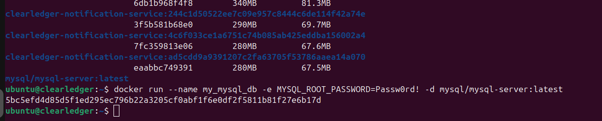
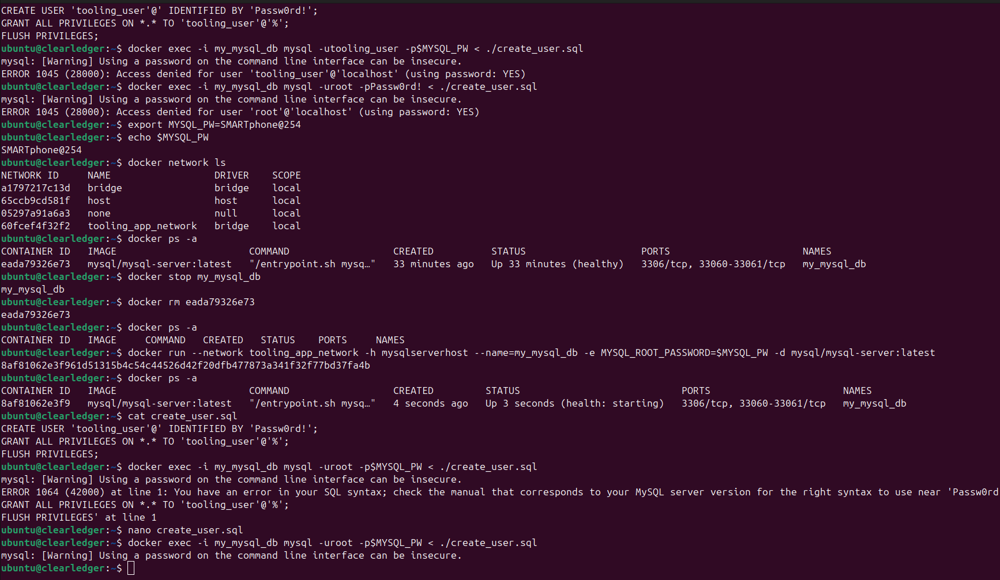

# Migration to Cloud with containerization (Docker & Doker Compose)
This project will allow you to work with docker containers, building images from scratch and running them locally and thereafter creating a docker compose to simulate how a multi-containers architecture can be managed.


## Introduction

We have two repo the php-todo-app and a tooling app repo. The repo will be cloned locally and docker file will be build to contain the application.

### Mysql in Container

Starting with the database
Pulling Mysql docker image
```sh
   docker pull mysql/my_mysql_db:latest
```
Verifying the image pulled
```sh
   docker images ls
```


Deploying Mysql container



Creating a Docker network for the containers to communicate

## Connecting to Mysql server from a second container running Mysql Client


## Clonning Tooling-app Repo 

```sh
git clone https://github.com/StegTechHub/tooling-02.git tooling
cd tooling-02
```

Updating the mysql database schema with the configuration file on db_conn.php


Update the application code in `./html/`

Creating a Dockerfile for tooling app
and building the image in order to run the container


## Accessing the Application on Browser
navigating to http://localhost:8085 to access the application


Logging in to the app with default username and password


## Implementing a POC to migrate the PHP-Todo app into a containerised application
Using the same mysql database to connnect a php-todo-app and containerise the application by creating a dockerfile

### Clonning the php-todo-app
```sh
     git clone https://github.com/StegTechHub/php-todo
```


Creating a Dockerfile for php-todo-app


Building the dockerfile fo the application


### Accessing the application 
Navigate to the browser to access the php-todo-app


## Pushing the Image to Dockerhub
if already have an existing Dockerhub account login on cli via
```sh
   docker login
```


Confirming the Docker Images on Dockerhub


### Creating a Jenkins Pipeline for the CI 
On the php-todo-app folder create a Jenkins file
Installing and running Jenkins on container


Accessing the jenkins UI on the browser


Creating a Job 


Updating the Jenkins file to connect with Github repo


Building the pipeline


### Verifying that the images pushed from the CI can be found on Dockerhub
Accessing the Dockerhub and openning the images folder


Accessing the Application on Browser

